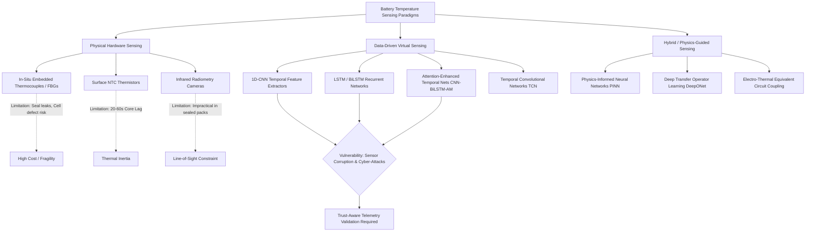

# Figure 1: Comprehensive Taxonomy of Battery Temperature Sensing

```mermaid
graph TD
    Root[Battery Temperature Sensing Paradigms]
    
    Root --> P[Physical Hardware Sensing]
    Root --> V[Data-Driven Virtual Sensing]
    Root --> H[Hybrid / Physics-Guided Sensing]
    
    P --> P1[In-Situ Embedded Thermocouples / FBGs]
    P --> P2[Surface NTC Thermistors]
    P --> P3[Infrared Radiometry Cameras]
    
    P1 -.->|Limitation: Seal leaks, Cell defect risk| Neg1[High Cost / Fragility]
    P2 -.->|Limitation: 20-60s Core Lag| Neg2[Thermal Inertia]
    P3 -.->|Limitation: Impractical in sealed packs| Neg3[Line-of-Sight Constraint]
    
    V --> V1[1D-CNN Temporal Feature Extractors]
    V --> V2[LSTM / BiLSTM Recurrent Networks]
    V --> V3[Attention-Enhanced Temporal Nets CNN-BiLSTM-AM]
    V --> V4[Temporal Convolutional Networks TCN]
    
    V1 & V2 & V3 --> ValReq{Vulnerability: Sensor Corruption & Cyber-Attacks}
    ValReq --> S1[Trust-Aware Telemetry Validation Required]
    
    H --> H1[Physics-Informed Neural Networks PINN]
    H --> H2[Deep Transfer Operator Learning DeepONet]
    H --> H3[Electro-Thermal Equivalent Circuit Coupling]
```
