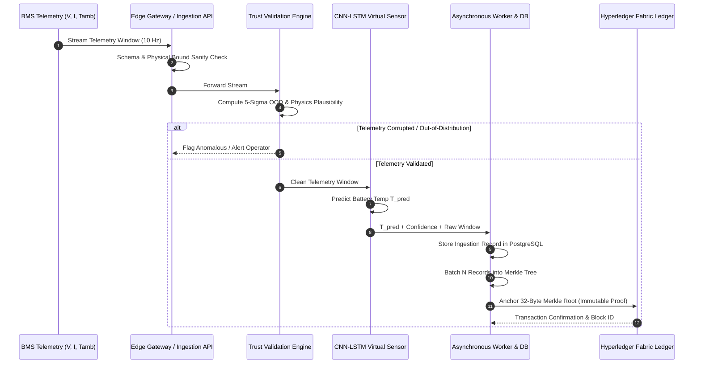

# Figure 3: End-to-End Trust-Aware Telemetry & Blockchain Provenance Pipeline

```mermaid
sequenceDiagram
    autonumber
    participant Sensor as BMS Telemetry (V, I, Tamb)
    participant Edge as Edge Gateway / Ingestion API
    participant Trust as Trust Validation Engine
    participant AI as CNN-LSTM Virtual Sensor
    participant Worker as Asynchronous Worker & DB
    participant Ledger as Hyperledger Fabric Ledger

    Sensor->>Edge: Stream Telemetry Window (10 Hz)
    Edge->>Edge: Schema & Physical Bound Sanity Check
    Edge->>Trust: Forward Stream
    Trust->>Trust: Compute 5-Sigma OOD & Physics Plausibility
    alt Telemetry Corrupted / Out-of-Distribution
        Trust-->>Edge: Flag Anomalous / Alert Operator
    else Telemetry Validated
        Trust->>AI: Clean Telemetry Window
        AI->>AI: Predict Battery Temp T_pred
        AI->>Worker: T_pred + Confidence + Raw Window
        Worker->>Worker: Store Ingestion Record in PostgreSQL
        Worker->>Worker: Batch N Records into Merkle Tree
        Worker->>Ledger: Anchor 32-Byte Merkle Root (Immutable Proof)
        Ledger-->>Worker: Transaction Confirmation & Block ID
    end
```
