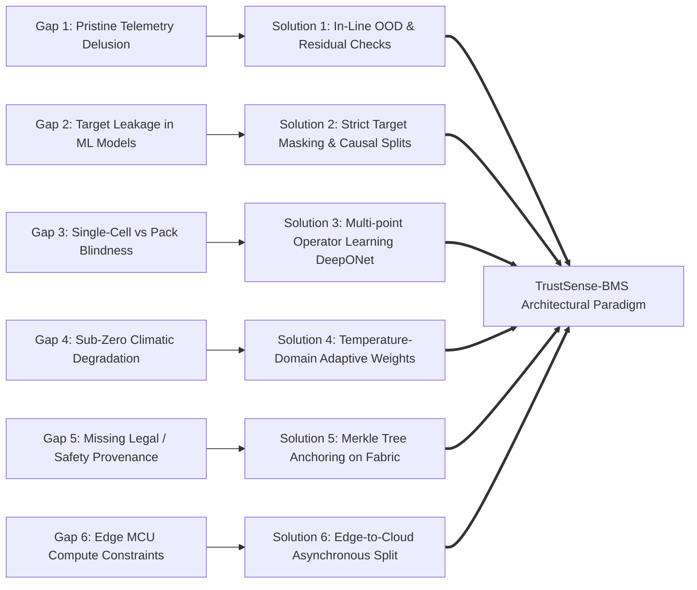

# Figure 4: Research Gap Connectivity Map

```mermaid
graph LR
    G1[Gap 1: Pristine Telemetry Delusion] --> S1[Solution 1: In-Line OOD & Residual Checks]
    G2[Gap 2: Target Leakage in ML Models] --> S2[Solution 2: Strict Target Masking & Causal Splits]
    G3[Gap 3: Single-Cell vs Pack Blindness] --> S3[Solution 3: Multi-point Operator Learning DeepONet]
    G4[Gap 4: Sub-Zero Climatic Degradation] --> S4[Solution 4: Temperature-Domain Adaptive Weights]
    G5[Gap 5: Missing Legal / Safety Provenance] --> S5[Solution 5: Merkle Tree Anchoring on Fabric]
    G6[Gap 6: Edge MCU Compute Constraints] --> S6[Solution 6: Edge-to-Cloud Asynchronous Split]

    S1 & S2 & S3 & S4 & S5 & S6 ==> Platform[TrustSense-BMS Architectural Paradigm]
```
